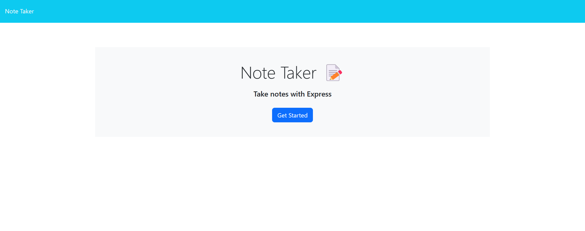
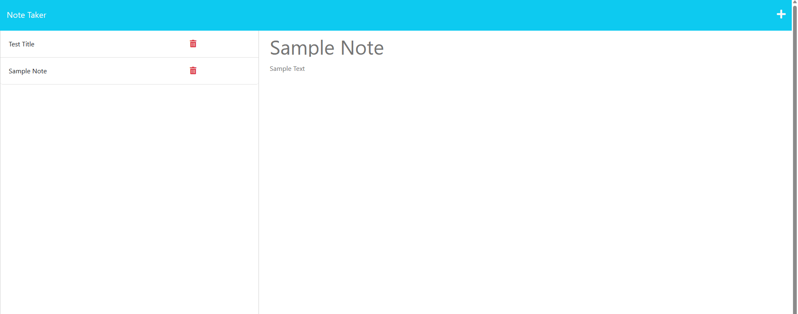

# Note Taker App

## Description

This is a note-taking app which puts together the `front end` starter code with the `backend` using `express` so you can enjoy taking some quick notes in the browser.

## How it works ?

Click Get Started. Fill in some text and then save your note. You can also delete notes that you no longer need.

## Usage

To Run Locally -

> `git clone` this repository then run a `npm i` to install the required dependencies and lastly run `node server` to launch this locally.

To Run via Heroku -

> Click the herkou link: https://note-taker-list-app-915f9ff291f2.herokuapp.com/

## Credits

Sameer Mirza | Columbia Coding Bootcamp
